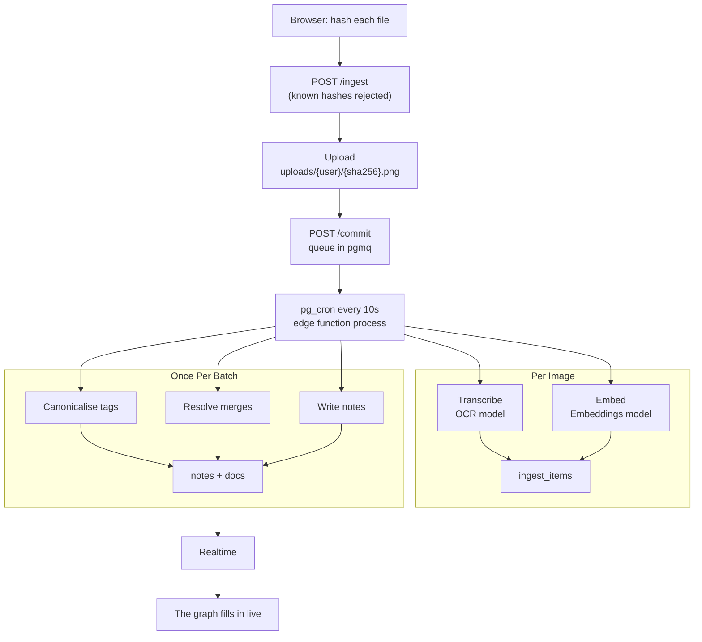

# Pivot


Drop 200 screenshots in. Get a knowledge graph out.

Pivot reads every screenshot, PDF and note you throw at it, writes each one up
as a note, works out which of them were really the same thing seen across
several files, and keeps your tag vocabulary from sprawling. Everything runs on Supabase and any
OpenAI-compatible model endpoint — including your own.

---

## Quickstart

```bash
pnpm install
pnpm setup      # the wizard: enter accepts every default
pnpm dev
```

On a local stack `pnpm dev` runs two things: Vite, and `supabase functions serve`.
Both are needed — `supabase start` has no way to hand a function its secrets, so
an edge function only sees `AUTH_ENABLED` and the model keys while
`functions serve` is running. Against a hosted project the functions run in the
cloud and `pnpm dev` is just Vite.

`pnpm setup` asks where Supabase lives, whether you want authentication, and
which models to use. Then it applies the schema, creates the storage bucket,
deploys the edge functions, sets their secrets and schedules the worker.

You need [Node 22+](https://nodejs.org), [pnpm](https://pnpm.io), the
[Supabase CLI](https://supabase.com/docs/guides/cli), and Docker if you want the
local stack.

---


## What can go in


|                                                     | how it is read                                                                                                                                                                                                                       |
| --------------------------------------------------- | ------------------------------------------------------------------------------------------------------------------------------------------------------------------------------------------------------------------------------------ |
| `png` `jpg` `jpeg` `webp` `gif` `bmp` `heic` `heif` | the vision model transcribes it                                                                                                                                                                                                      |
| `md` `txt`                                          | kept verbatim; one model call titles, describes and tags it                                                                                                                                                                          |
| `pdf`                                               | every page is rendered to an image in your browser and read by the vision model — so tables, charts and layout survive. The PDF itself stays one document: it is what you click in a note's carousel, however many notes it produced |


A dense PDF becomes several notes; a PDF about one thing becomes one. That is
the same merge test screenshots go through, not a separate code path.

Anything else is refused at the door, with the reason. Attaching a file to a
note by hand accepts any type — it is stored, listed and openable, just not read
by a model.

---


## What happens to a file




**Deduplication.** Every file is SHA-256'd in the browser before anything moves.
A hash you already have is answered in the planning request — the bytes are
never uploaded and the model is never called.

**Expansion.** A PDF is rendered page by page in the browser (pdf.js, loaded
only when you actually drop one) and each page is ingested as its own item that
names the PDF as its source. Nothing else expands: one file, one item.

**Transcription.** Each item goes to an OpenAI-compatible chat model as
`{title, markdown, description, tags}`. `markdown` is a complete transcription,
not a summary — and for a text file it is your own text, untouched.

**Tags.** New tags are embedded and shortlisted against your existing vocabulary
by cosine distance, then a single model call decides the mapping. This is what
stops `linkedin-links` becoming a second tag next to `linkedin` — and what stops
`linkedin` and `twitter` collapsing into each other, which a distance threshold
alone would eventually do.

**Merging.** Each item is judged against four candidates: the item before it,
the item after it, and the two nearest existing notes. Those pairwise verdicts
are unioned, so three screenshots of one profile become one note even though no
single model call ever saw all three. The test is deliberately strict — two
different people's profiles stay two notes.

---


## Configuration

Everything is set by `pnpm setup` and lives in `.env` (server) and `.env.local`
(frontend). See `[.env.example](.env.example)` for the full list.


|                       | default                             |                                                            |
| --------------------- | ----------------------------------- | ---------------------------------------------------------- |
| `AUTH_ENABLED`        | `true`                              | `false` runs a single-user instance with no sign-in screen |
| `OCR_BASE_URL`        | Gemini's OpenAI-compatible endpoint | any chat endpoint that accepts images                      |
| `OCR_MODEL`           | `gemini-flash-latest`               |                                                            |
| `EMBED_BASE_URL`      | `https://api.openai.com/v1`         | any OpenAI-compatible embeddings endpoint                  |
| `EMBED_MODEL`         | `text-embedding-3-small`            |                                                            |
| `EMBED_DIM`           | `1536`                              | baked into the schema; changing it later needs a reset     |
| `TAG_MATCH_THRESHOLD` | `0.78`                              | cosine floor for the tag shortlist                         |
| `OCR_CONCURRENCY`     | `5`                                 | parallel model calls — match your provider's rate limit    |
| `BATCH_SIZE`          | `25`                                | queue messages drained per worker tick                     |


Provider keys are edge-function secrets. They never reach the browser.

### Authentication off

Pick "no" at the auth question and Pivot runs as a single local user: no sign-in
screen, the anon key acts as that user, and row-level security still applies —
the wizard records a local user id in `app_config` and every policy resolves
through it. Suitable for a private instance; do not expose it publicly.

---


## Layout

```
src/                     frontend (React + Vite)
  lib/                     the only bridge to the backend
  Auth.tsx                 sign-in, rendered only when auth is on
supabase/
  migrations/              schema, RLS, storage, queue, RPCs
  functions/ingest/        plan · upload · commit
  functions/process/       the worker: transcribe, canonicalise, merge, write
  functions/_shared/       pure logic + a small OpenAI-compatible client
scripts/setup.mjs          the onboarding wizard
scripts/worker.mjs         local fallback for the cron job
scripts/smoke.mjs          end-to-end check
```

The frontend talks to the backend only through `src/lib/`. Nothing else in
`src/` knows Supabase exists.

---


## Development

```bash
pnpm test        # pure pipeline logic — merge chaining, tag mapping, note assembly
pnpm typecheck   # frontend and edge functions
pnpm smoke ./fixtures
pnpm worker      # drive the worker by hand instead of waiting for pg_cron
```

`pnpm smoke` takes a folder of screenshots, duplicates one to exercise dedupe,
runs the real pipeline and asserts the invariants — then prints the grouping it
produced so you can judge the merge decisions yourself. A good fixture set is
three shots of one person's profile, one shot of a different person's, and one
unrelated screenshot.

If notes never appear, `pg_cron` probably cannot reach the edge runtime from
inside Docker — common on Linux and Colima. Run `pnpm worker` in another
terminal; it drives the same function over HTTP.

---


## Contributing

See [CONTRIBUTING.md](CONTRIBUTING.md).

## License

[PolyForm Noncommercial 1.0.0](LICENSE). Free to use, modify and share for
personal projects, hobby work, study, research and other noncommercial purposes.
Selling it, or using it in or for a business, is not permitted. If you want a
commercial licence, open an issue.

Note that this is a source-available licence, not an OSI open source one: it
restricts the field of use.